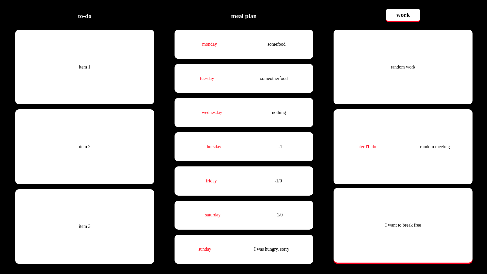

# TTM

TTM is a simple tiling task manager that uses vim/calcurse key bindings. You can access it right [here](https://owozsh.github.io/ttm/). A black screen is expected to appear, follow the tutorial below to learn how to use it :)

### Tutorial

Start by adding a new column (press n), and then you can add you items (press a). For more shortcuts, take a look at the key bindings.

### Key Bindings

- n -> new column
- a -> add item
- A -> add scheduled item
- d -> remove item
- D -> remove column
- j -> select below item
- k -> select above item
- l -> select next column
- h -> select previous column
- J -> swap below item
- K -> swap above item

### Warning

This tool is under development, you may loose any data while using it. None of your data is stored with me, they're all stored in you browser's local storage ( you can clear it by typing 'localStorage.clear()' aat you browser's console.

### Roadmap

- [ ] mouse support
- [ ] workspaces
- [ ] themes
- [ ] responsiviness
- [ ] schedule notification
